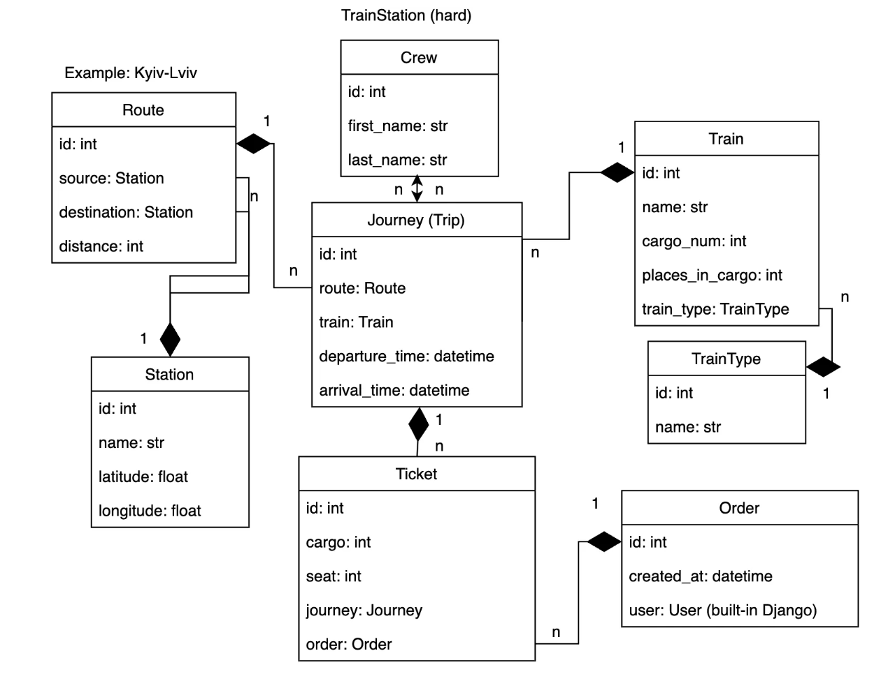

# Train-station-RESTful-API

The Train Station API Service is a RESTful API that manages a train transportation system. The service allows users to explore train stations, routes, journeys, and ticket bookings, providing a backend system for travelers to easily plan and book their train trips.

## Getting Started
These instructions will help you set up the Train Station API Service for development and testing purposes.

### Installation
1. Clone the repository:
   ```sh
   git clone https://github.com/MaksymBus/Train-station-RESTful-API.git
   cd train_station_service
   ```
2. Create a virtual environment and activate it:
   ```sh
   python -m venv venv
   source venv/bin/activate
   venv\Scripts\activate (on Windows)
   ```
3. Install the required dependencies:
   ```sh
   pip install -r requirements.txt
   ```
4. Set up environment variables:
   Create a `.env` file in the root directory and add the following variables:
   ```
   # Django
    SECRET_KEY=<your-secret-key>
    DEBUG=True/False
    
    # DB
    POSTGRES_USER=<db_user>
    POSTGRES_PASSWORD=<db_password>
    POSTGRES_DB=<db_name>
    POSTGRES_HOST=<db_host>
    POSTGRES_PORT=<db_port>
    PGDATA=/var/lib/postgresql/data
   ```

### Running with Docker
1. Build and start the services:
   ```sh
   docker-compose up --build
   ```
2. The application will be accessible at `http://127.0.0.1:8000/api/`.

## Optionally

#### Loading Initial Data:
To load sample data:
```sh
docker exec -it <your_container_name> sh
python manage.py loaddata train_station_data.json
```

#### Creating a Superuser:
To access the admin panel, create a superuser:
```sh
docker exec -it <your_container_name> sh
python manage.py createsuperuser
```
Use the following credentials when prompted:
- Email: `test@user.com`
- Password: `test_12345`

## Usage
### Authentication
The API uses JWT for authentication. You can obtain a token by sending a POST request to:
```sh
POST /api/user/token/
```

You will receive access and refresh tokens to authenticate API requests.

### Available Endpoints
- `/stations/` - Manage train stations.
- `/routes/` - Manage train routes between stations.
- `/trains/` - Manage trains and their types.
- `/crews/` - Manage crew members.
- `/journeys/` - Manage journeys (schedules).
- `/orders/` - Manage ticket orders.


## Features
- **JWT Authentication**: Secure access to the API using JSON Web Tokens (JWT).
- **Admin Panel**: Accessible at /admin/ for managing the database.
- **API Documentation**: Available at api/schema/swagger-ui/ or api/schema/redoc/ for easy exploration of available endpoints.
- **Order and Train Station Management**: Manage orders and train stations through a user-friendly interface.
- **Station Management**: Create and read train stations.
- **Route Management**: Manage train routes between stations, including distance and validation to avoid circular routes.
- **Train & Train Type Management**: Define trains with their capacities and types, and manage the available trains in the system.
- **Journey Management**: Define journeys including route, train, crew, departure, and arrival times.
- **Crew Management**: Manage train crew members who are assigned to specific journeys.
- **Ticket Booking System**: Book tickets for journeys, including cargo and seating selection.
- **User Authentication**: Users can register, log in, and manage orders.


## Database Structure


